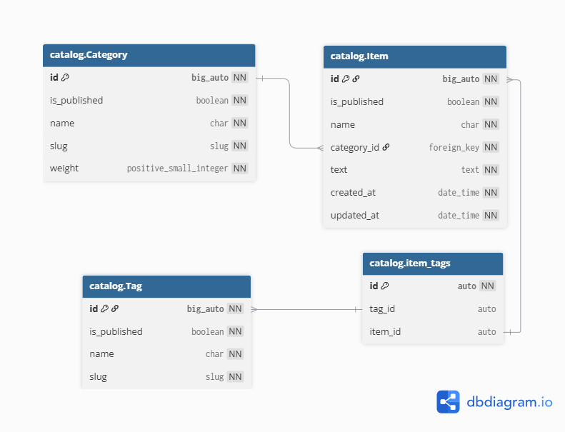

# Marketplace Project

## 📊 ER Diagram

<picture>
    <source media="(prefers-color-scheme: dark)" srcset="db_schemas/ER_black.jpg" />
    <source media="(prefers-color-scheme: light)" srcset="db_schemas/ER_white.jpg" />
    
</picture>
